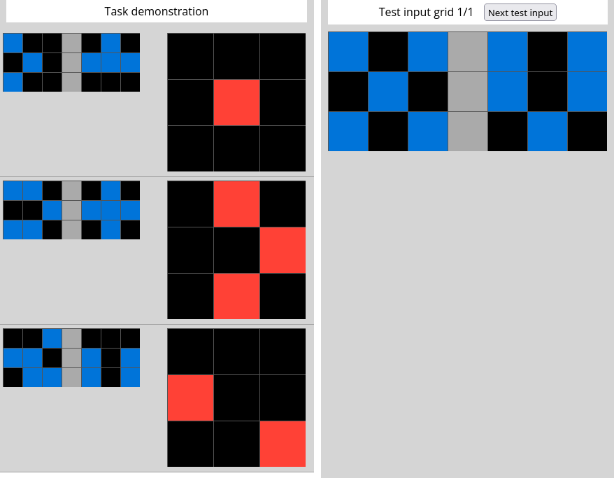

# ARC-AGI repository

The [ARC-AGI repository](https://github.com/fchollet/ARC-AGI) contains some sample problems for the ARC, 
and a web-based viewer to view them.

## Sample problems

There are some simpler problems stored under `data/training` and some harder problems stored under `data/evaluation`.
The idea is you train your AI program using the simpler problems and then run it on the evaluation problems. There is
also a secret series of evaluation problems used for the ARC Prize itself; these have to be secret otherwise
as very simple program could overfit to those problems.

Each problem is a JSON file, for example, `data/training/0520fde7.json` is (when pretty-printed):

```json
{"train": [
    {"input":  [[1, 0, 0, 5, 0, 1, 0], 
                [0, 1, 0, 5, 1, 1, 1], 
                [1, 0, 0, 5, 0, 0, 0]], 
     "output": [[0, 0, 0], 
                [0, 2, 0], 
                [0, 0, 0]]}, 
    {"input":  [[1, 1, 0, 5, 0, 1, 0], 
                [0, 0, 1, 5, 1, 1, 1], 
                [1, 1, 0, 5, 0, 1, 0]], 
     "output": [[0, 2, 0], 
                [0, 0, 2], 
                [0, 2, 0] ]}, 
    {"input":  [[0, 0, 1, 5, 0, 0, 0], 
                [1, 1, 0, 5, 1, 0, 1], 
                [0, 1, 1, 5, 1, 0, 1]], 
     "output": [[0, 0, 0], 
                [2, 0, 0],  
                [0, 0, 2]]}], 
 "test": [
    {"input":  [[1, 0, 1, 5, 1, 0, 1], 
                [0, 1, 0, 5, 1, 0, 1], 
                [1, 0, 1, 5, 0, 1, 0]], 
     "output": [[2, 0, 2], 
                [0, 0, 0], 
                [0, 0, 0]]}]}
```


## Web-based viewer

This is stored in `apps/testing_interface.html`. 

On the web-based viewer, the problem above looks like:



### Colours

In the JSON, the value for each square in the grid is an integer from 0 to 9. On the viewer they are displayed as colours. The mapping from integer to
colour is arbitrary, but the viewer uses these (from `apps/css/common.css`):

```css
.symbol_0 {
    background-color: #000;
}
.symbol_1 {
    background-color: #0074D9; /* blue */
}
.symbol_2 {
    background-color: #FF4136; /* red */
}
.symbol_3 {
    background-color: #2ECC40; /* green */
}
.symbol_4 {
    background-color: #FFDC00; /* yellow */
}
.symbol_5 {
    background-color: #AAAAAA; /* grey */
}
.symbol_6 {
    background-color: #F012BE; /* fuschia */
}
.symbol_7 {
    background-color: #FF851B; /* orange */
}
.symbol_8 {
    background-color: #7FDBFF; /* teal */
}
.symbol_9 {
    background-color: #870C25; /* brown */
}
```

I will use the same colour encodings in any UI I create.
