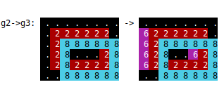

# Arclike

Some notes on my program **Arclike**, Which is available on <i class='fab fa-github'></i> Github at <https://github.com/cabalamat/arclike>.

[TOC]

## Terminology

A **problem** consists of multiple **tasks**, each of which can be a **training** task or a **test** task. Here is a problem with 3 training tasks and 1 test task:


```json
{"train": [
    {"input":  [[1, 0, 0, 5, 0, 1, 0], 
                [0, 1, 0, 5, 1, 1, 1], 
                [1, 0, 0, 5, 0, 0, 0]], 
     "output": [[0, 0, 0], 
                [0, 2, 0], 
                [0, 0, 0]]}, 
    {"input":  [[1, 1, 0, 5, 0, 1, 0], 
                [0, 0, 1, 5, 1, 1, 1], 
                [1, 1, 0, 5, 0, 1, 0]], 
     "output": [[0, 2, 0], 
                [0, 0, 2], 
                [0, 2, 0]]}, 
    {"input":  [[0, 0, 1, 5, 0, 0, 0], 
                [1, 1, 0, 5, 1, 0, 1], 
                [0, 1, 1, 5, 1, 0, 1]], 
     "output": [[0, 0, 0], 
                [2, 0, 0],  
                [0, 0, 2]]}], 
 "test": [
    {"input":  [[1, 0, 1, 5, 1, 0, 1], 
                [0, 1, 0, 5, 1, 0, 1], 
                [1, 0, 1, 5, 0, 1, 0]], 
     "output": [[2, 0, 2], 
                [0, 0, 0], 
                [0, 0, 0]]}]}
```


## Program Structure

### grid.py

Implements `Grid`, a 2-dimensional array of coloured squares.

### gridfun.py = grid functions

Contains grid functions, i.e. functions that act on grids.

### problem.py

Implements `Problem` which contains multiple `Task` instances.

### patrec.py = pattern recogniser

Implements **pattern recognisers** (**patrecs**). These look at input grids and output grids and suggest a function that, given the input(s) will
produce something similar to the outputs. Them the result of this function can be used by other patrecs until a full solution is achieved.

The first patrec will be a very simple one that changes all squares that're one colour to another.

Consider the following problem, with these training tasks:

```
train[0]  ..1234..  -> ..8234.. 
          566..777     566..999
          ....1111     ....8888
```
Here, everywhere that was 1 becomes 8, and every 7 becomes 9.

The patrec will suggest a function converting 1->8, and then on the output of that function it will suggest another function converting 7->9.
These functions will be chained together to form the final **solution function**.

### funrack.py = function rack

The function rack is short-term memory where functions that're part of the solution to a task are held.


## Road Map

Arclike will be developed in this order:

`Grid` class to hold a 2-dimensional grid of coloured squares. Some functions for prettyprinting grids and transfomations between
them on the console, e.g.:



Some grid functions (functions which act on Grids) in `gridfun.py`.

A `Problem` class that holds a problem, i.e. a set of training tasks, plus one or more inputs without outputs (called *tests*), where 
the job of the AI is to find the output for those inputs.

Reading problems from the JSON files in the [ARC-AGI repository](arc_agi_repository).

Then we can get to the important task of solving the ARC-AGI problem!

The simple solution will be to have various grid functions, and pattern recognisers that can suggest solutions, e.g. a grid function with some parameters
to determine how it works. The candidate solutions can them be compared to the actual result and perform the same task on the ones with the lowest *loss*,
until you get a candidate solution with zero loss, which is then applied to the question, forming the answer.

More intelligent ways of doing the above.

Ways of doing the above so the AI learns, i.e. if it has done a task and subsequently gets a similar task, it recognises it is similar, and can solve it more quickly. 

 
