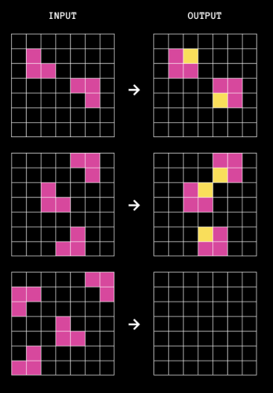

# Similar problems to ARC-AGI

*This page describes ARC-AGI and similar problems*

[TOC]

All 3 are AI problem domains where an AI is trying to solve a problem, and where the creators
of the problem domain expect that if an AI is build that solves it, then something of value will 
transfer to other similar domains.

## ARC-AGI

[**ARC-AGI**](https://arcprize.org/blog/launch), also known as **ARC Prize**, is a problem domain where you are presented with a series of *tasks*. 
Each task has some *training pairs*, containing an input and the corresponding output. The AI has to work out the rule that converts the input to the output.

Then the AI is given one or more *test pairs*, showing just the input and it has to say what the corresponding output is.

### Example problem



Here each input grid contains a 2x2 pink square with one element missing, and in the corresponding output yellow is put where the missing element goes.

The problem can be thought of as a function which takes a grid as input and returns another grid. And indeed, that's how 
many solutions to ARC-AGI attempt to solve it: by creating lots of programs and when they have a program that does all the training pairs correctly,
they run it on the test pairs.

But an ARC-AGI task can also be thought of, not as a function, but as a pattern that has to be recognised. In the sample given,
each connected block of pink can be thought of as a suqar with a piece missing, and then with the piece filled in (in yellow).

It's a subtle difference but I think an important one.

## Copycat

[Copycat](https://en.wikipedia.org/wiki/Copycat_(software)) is an analogy-making program, developed in 1988 by Douglas Hofstadter, Melanie Mitchell, and others.

Here each task has exactly one training pair and exactly one test pair.

### Example problem 

    abc -> abd ; ijk -> ?

Here, the training pair is `abc`->`abd` and the test pair is `ijk`->? . 

Or, expressed in English, `abc` is to `abd` as `ijk` is to what? 

The answer expected is `ijl`, replacing the last character by its successor.

Copycat is explicitly a program to find a pattern and not a function. if it was a function, the function could just as well be "replace the last character with `d` ",
or "replace the whole input with `abd`".

### Feynman's objection

In his book Metamagical Themas, Hofstadter relates Richard Feynmann's objection to the Copycat domain:

> Speaking of rigidity versus fluidity, when I gave a lecture on analogies in the
Physics Department at the California Institute of Technology several years ago, one
Richard Feynman sat in the front row and bantered with me all the way through the
lecture. I considered him a "benevolent heckler", in the sense that he would reliably
answer each question "What is to X as 4 is to A?" with the same answer, "4! ", and
insist that it was a good answer, probably the best. It seemed to me that Feynman not
only was acting the part of the "village idiot", but even was relishing it. It was hard to
tell how much he was playing devil's advocate and how much he was sincere. In any
case, I will never forget the occasion, since his arguing with me stimulated me no end,
and at least from my point of view, it wound up being one of the best lectures I have
ever given.


I think Feynmann's objection is simply that there are many functions which transform `abc` -> `abd` and with only one training pair it is impossible to tell
which is the correct one.

Given the problem

    abc -> abd ; pqrs -> ?

Hofstadter further says:

>  The more you look at the question of how to do "the same thing" to pqrs, the
more possibilities you see. For instance, many people seem to like pqst, in which the
first two letters are left alone and subsequent letters are replaced by their successors.
Occasionally, people have suggesed pqtu, a rather ingenious notion based on seeing rs
as a single unit whose successor is the unit tu. Somebody pointed out that qrst is a
possibility, based on the idea of changing all letters but a and b to their successors.
And one time someone sug-jested dddd, whose justification resides in the even more
village-idiotic notion of changing all letters but a and b to d !

I think this makes it clear Hofstadter is thinking in terms of finding a pattern rather than creating a function that performs the transformation.
After all, you're supposed to notice that `abc` is three letters in succession, that `d` is the successor to `c`, and that `pqrs` is similarly four letters
in succession, and that the answer should include all that information. That's why `dddd` is considered a stupid answer.

### Comparing ARC-AGI and Copycat

ARC-AGI and Copycat are clearly very similar ideas, so similar that they can best be compared by listing the differences between them:

1. in ARC-AGI, a value is a 2-dimiensional grid of coloured squares; in Copycat it is a string on lower-case letters
2. in ARC-AGI, a task can have multiple training pairs and multiple test pairs; in Copycat there is exactly one training pair and one test pair

## Function Predictor

Function Predictor (FP) is my idea of an AI problem domain similar to ARC-AGI and Copycat. The main difference is that in FP, a task explicitly
has a function behind it.

In FP a pair is of the form 

    input -> [box] -> output

The box is opaque: you can see the input to it and output from it, but you can't look inside. The goal of the program is to predict what it's doing.

### Learning

It is explicitly a goal of the Function Predictor domain that an AI solving it should be able to learn. So if it completes one task, and then encounters
a similar task, it should say to itself "aha! this reminds me of..." and do the second task quicker.

As an example, imagine the first task has these training pairs:

```
"xxxii" -> 32
"i" -> 1
"mmxxiv" -> 2024
...etc
```

And then later the AI was given a task that was the same thing in reverse:

```
19 -> "xix"
4 -> "iv"
267 -> "cclxvii"
```

The AI should immediately see what's going on and solve the problem more quickly.